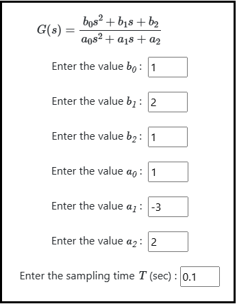
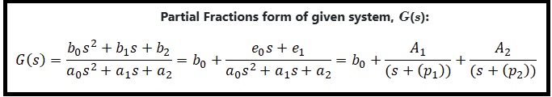
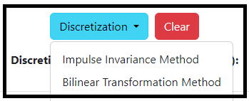
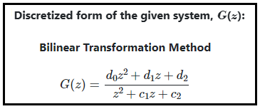

### Procedure

<b>Steps to perform the simulation</b>
										
<ol type="1">

<li> At first enter the coefficient values of the transfer function and sampling time T. </li> 

  
<b>Fig. 1. Coefficient values entry for continuous transfer function</b> 						  

 

<li> Click on 'G(s)' button to get the partial fraction form of the given transfer function.</li> 

            

 

  
<b>Fig. 2. Partial fraction form of continuous transfer function</b> 							  

 

<li> Clicking on 'Discretization' dropdown-menu for different methods.  </li> 

  
<b>Fig. 3. Dropown menu for selecting discretization menthod</b> 							  

 

<li> Click on the desired option to get the discrete form of the system.</li> 

  
<b>Fig. 4. Desired option toget the disctre form </b> 						  

 

<li> Results of the discretized form will be displayed for the selcted method. </li> 

<li> Results of the discretized form: Impulse Invariance Method. </li> 

   
<b>Fig. 5. Discretization form of Impulse Invariance Method</b> 						 

 

<li> Results of the discretized form: Bilinear Transformation Method. </li> 

  
<b>Fig. 6. Discretization form of Bilinear Transformation Method </b> 						 

 

<li> Click on 'Clear' button to get results for new transfer function.</li>  

</ol>

