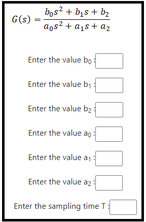
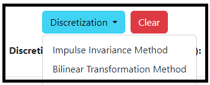
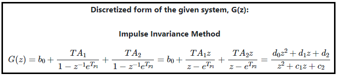
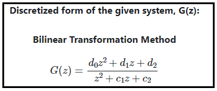

### Procedure

<b>Steps to perform the simulation</b>

										
1. At first enter the coefficient values of the transfer function and sampling time T. 

<b>Fig. 1. Coefficient values entry for continuous transfer function</b>						  

2. Click on 'G(s)' button to get the partial fraction form of the given transfer function.

<b>Fig. 2. Partial fraction form of continuous transfer function</b>							  

3. Clicking on 'Discretization' dropdown-menu for different methods.  

<b>Fig. 3. Dropown menu for selecting discretization menthod</b>							  

4. Click on the desired option to get the discrete form of the system.

<b>Fig. 4. Desired option toget the disctre form </b>						  

    
5. Results of the discretized form will be displayed for the selcted method.

6. Results of the discretized form: Impulse Invariance Method.

<b>Fig. 5. Discretization form of Impulse Invariance Method</b>						 

7. Results of the discretized form: Bilinear Transformation Method. 

<b>Fig. 6. Discretization form of Bilinear Transformation Method </b>						 

8. Click on 'Clear' button to get results for new transfer function.

